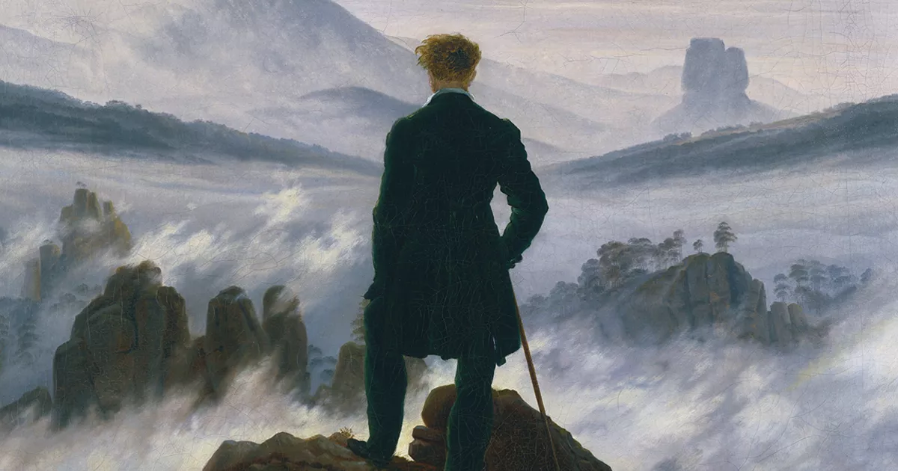

So I did it. After writing that first note in an insomnia, I impulsively created a blog. I did instead of just thinking. That’s quite unexpected. At least before I started writing I never thought I wanted to make a blog. But then making it sounded fun, like the right thing to do, and so I did it. This is somewhere I can just write whatever I want, maybe that’s what I need now.

I don’t need to be heard, but it feels good that my lost thoughts can stick somewhere. Maybe it becomes less meaningless to write. I want it to be free, to write how I want, to be wrong. I want it to sound like me and to be weird, like me. Weird is not a bad word, not something I mean like I'm different or better. It is more than just that, it's owning who I am, in its uniqueness, stranded from a norm, finding my own direction.

Writing is one of the only way my thinking can be reflective. Focused on the now, focused on my experiences. I think that’s what I want to share, meaningful experiences. My struggles with life, my personal projects like game development. Movies, games, mangas, musics and other things that marked me. Subjects I am passionated about like philosophy, politics or psychology. Maybe even some of my life, photography and films of my travels. Some kind of archive of my soul, before it all becomes lost in the great void.

There is no scheme, no long term goal. Just doing something I want to do.
